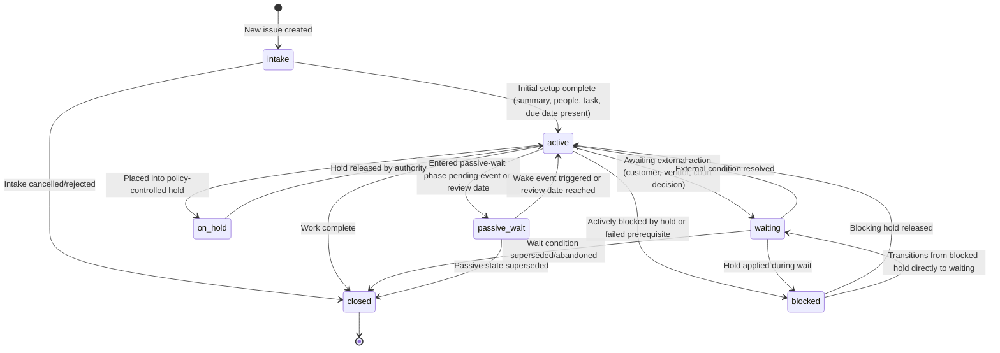
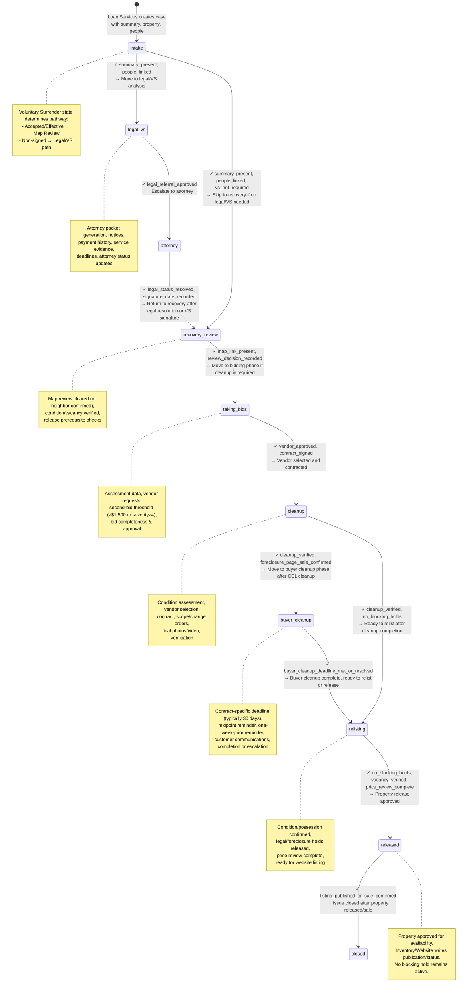
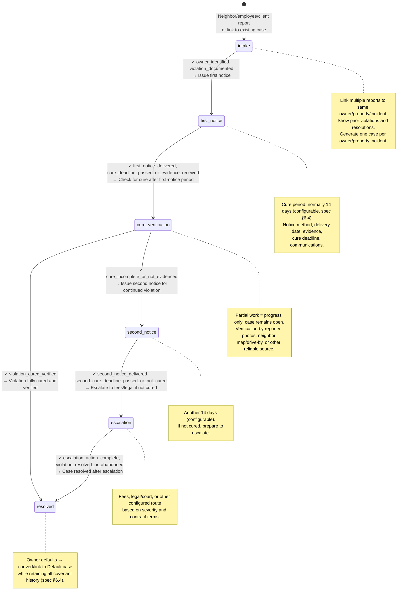
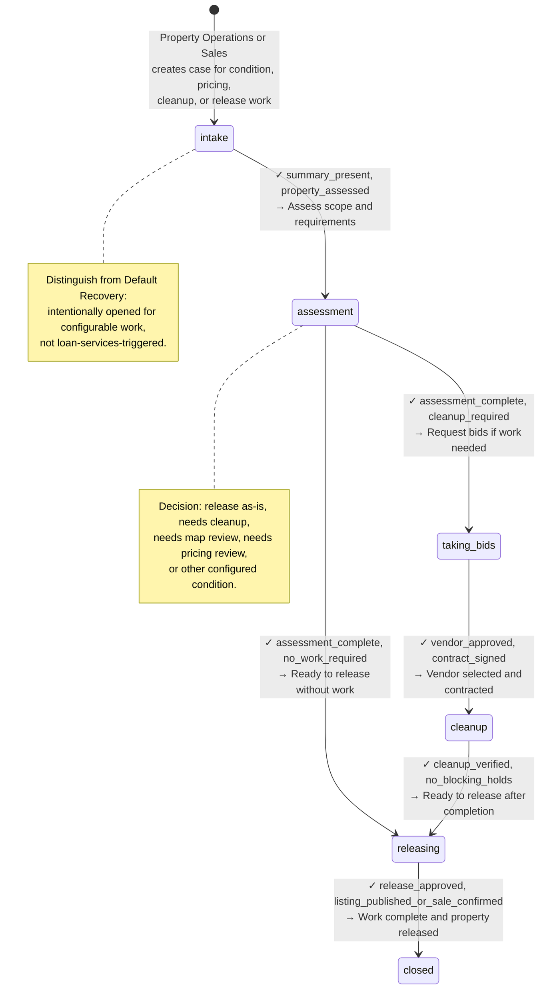
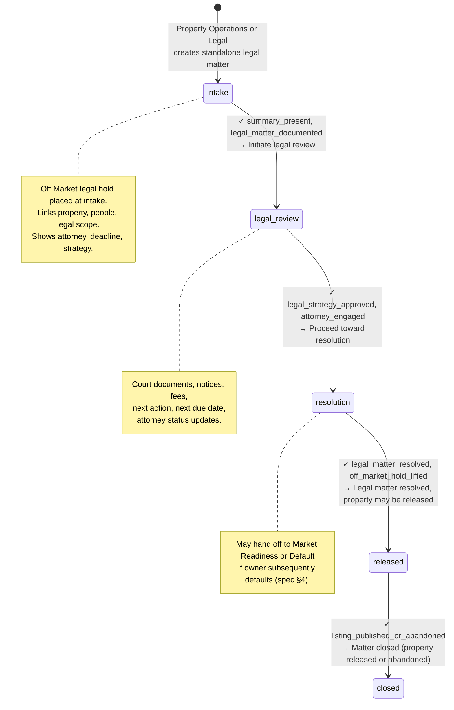

# Workflow State Machines — Property Operations Issues

Source: spec §17 (examples), §21 (transition engine), seed config (issue types, transitions, lifecycle_status).

All issue types execute within a shared `lifecycle_status` machine and their type-specific phase machines. This document defines each state, its prerequisites, and the allowed transitions.

## Lifecycle Status Machine

The `lifecycle_status` field on every issue tracks its operational readiness across all issue types. It is independent of the current phase.

**Rules:**
- An issue is never Active without (coordinator or queue) AND (summary) AND (next task) AND (future due date) [spec §21].
- Passive-wait states require a defined wake-up event or review date [spec §21].
- Transitions re-evaluate all prerequisites and holds at commit time; screen visibility is not the control [spec §21].

---

## Issue Type: Default / Property Recovery

Handles loan-triggered cases: voluntary surrender (signed or non-signed), legal/VS proceedings, property recovery, cleanup, and relisting.

**Phases (seeded):** `intake` → `legal_vs` → `attorney` → `recovery_review` → `taking_bids` → `cleanup` → `buyer_cleanup` → `relisting` → `released` → `closed`

**Prerequisite Details:**
- `no_blocking_holds`: no active hold exists (checked by eligibility service at commit time, spec §28.3).
- `cleanup_verified`: final photo/video and documented verification decision recorded (spec §6.3).
- `vacancy_verified`: confirmed vacant through neighbor, map, or other reliable evidence (spec §6.1).
- `price_review_complete`: if price not reviewed within 6 months, blocks release (spec §10).

---

## Issue Type: Covenant Violation

Active-owner case with linked reports, notices, cure periods, verification, and escalation.

**Phases (seeded):** `intake` → `first_notice` → `cure_verification` → (`second_notice` → `escalation`) → `resolved`

**Cycle Behavior:**
- First violation → resolved.
- New violation after completion → new Issue Cycle, preserving prior history (spec §7, §21).

---

## Issue Type: Market Readiness

Configurable case for CCL-controlled property needing work outside a default recovery pathway.

**Phases (seeded):** `intake` → `assessment` → `taking_bids` → `cleanup` → `releasing` → `closed`

**Status: Marked TBD in seed config.** Final naming/classification pending Emma decision (spec §18 open decision).

---

## Issue Type: Property Legal Matter

Standalone legal issue (land/boundary dispute, title matter, etc.); may place Off Market hold and later hand off.

**Phases (seeded):** `intake` → `legal_review` → `resolution` → `released` → `closed`

---

## Issue Type: Buyer Cleanup

Sold property with contractual cleanup obligation; created/activated by transaction notification.

**Phases (seeded):** `intake` → `scheduled` → `in_progress` → `completed` → `verified` → `closed`

```mermaid
stateDiagram-v2
    [*] --> intake: Sales notification or<br/>Property Operations creates case<br/>No CCL bid collection (buyer contracts)
    intake --> scheduled: ✓ contract_deadline_set, communications_initiated<br/>→ Schedule work with buyer/contractor
    scheduled --> in_progress: ✓ work_start_confirmed<br/>→ Work in progress
    in_progress --> completed: ✓ buyer_reports_completion, photos_provided<br/>→ Buyer reports work complete
    completed --> verified: ✓ completion_verified_or_deadline_met<br/>→ CCL verifies completion or deadline passes
    verified --> closed: ✓ outcome_recorded<br/>→ Case closed; report separately from CCL cleanup (spec §6.2)
    
    note right of intake
        Transaction gives deadline (typically 30 days),
        contract scope, buyer contact.
        Separate from CCL-performed cleanup.
    end note
    
    note right of scheduled
        Create midpoint and one-week-prior reminders.
        Add customer-provided action-date reminder.
    end note
    
    note right of in_progress
        Customer communications, evidence link,
        progress updates, unexpected delays.
    end note
    
    note right of completed
        Buyer claims completion with photos/evidence.
        CCL inspects or relies on photo evidence.
    end note
    
    note right of verified
        Escalate to covenant workflow if not completed.
        Report separately in disposition analysis (spec §6.2).
    end note
```

---

## Prose Walkthrough: Spec §17 Examples Mapped onto Machines

### Example A: Signed Voluntary Surrender with Map Clearance

1. **Intake (Default/Property Recovery):** Loan Services creates Default case with accepted VS (signature date recorded).
2. **Lifecycle:** `intake` → `active` (summary, people, task, due date all present).
3. **Phase:** `intake` → skip `legal_vs` and `attorney` (no non-signed pathway). Advance directly to `recovery_review`.
   - Prerequisite: `summary_present`, `people_linked`, `vs_not_required`.
4. **Recovery Review:** Coordinator pastes My Maps link, reviews current imagery, records "Map Review—cleared" with rationale and reviewer.
   - Prerequisite: `map_link_present`, `review_decision_recorded`.
5. **Release Checks:** Verify vacancy/condition through reliable evidence (spec §6.1). Check price review (within 6 months, spec §10).
6. **Relisting (if needed):** Advance to `relisting` or directly to `released` if no special-listing review required.
   - Prerequisites: `no_blocking_holds`, `vacancy_verified`, `price_review_complete`.
7. **Released & Closed:** Inventory/Website writes publication status. Issue closes after property becomes available or sale confirmed.

**Lifecycle path:** intake → active → released → closed.

---

### Example B: Non-Signed VS Proceeds to Legal, then Signs

1. **Intake (Default/Property Recovery):** Loan Services creates Default case; VS is not accepted (draft/sent/partially signed).
2. **Lifecycle:** `intake` → `active`.
3. **Phase:** `intake` → `legal_vs`.
   - Prerequisite: `summary_present`, `people_linked`.
4. **Legal/VS Phase:** Non-signed pathway. Loan Services assembles Attorney Packet with notices, certified-mail receipts, account history, communications.
5. **Attorney Phase:** Escalate to attorney.
   - Prerequisite: `legal_referral_approved`.
6. **Attorney Updates:** Track status, next action, deadline, attorney updates, fees, court documents (spec §6.1).
7. **Owner Signs Later:** Record signature date, attach/import completed form.
   - Move back to Recovery Review with `legal_status_resolved`, `signature_date_recorded`.
8. **Recovery Review → Released → Closed:** Proceed as in Example A.

**Lifecycle path:** intake → active → (legal_vs/attorney phases) → active → released → closed.

---

### Example C: Foreclosure Page Sale with Buyer Cleanup

1. **Default/Property Recovery Case Active:** Property is approved for Foreclosure Page marketing with True Discount and buyer cleanup obligation.
2. **Property placed on Foreclosure Page:** Case moves to passive-wait (or remains in `cleanup`/`relisting` phase with wait status).
   - Lifecycle: `active` → `passive_wait` (no recurring follow-up needed, awaiting sale event).
3. **Sales notification triggers:** Buyer Cleanup issue created by transaction event.
4. **Buyer Cleanup case:**
   - Phase: `intake` → `scheduled`.
   - Deadline: typically 30 days from sale (spec §6.2).
   - Tasks: midpoint reminder, one-week-prior reminder, customer-provided action-date reminder.
5. **Phases progress:** `scheduled` → `in_progress` → `completed` → `verified`.
6. **Escalation path:** If not completed by deadline, escalate to covenant enforcement workflow.
7. **Reporting:** Report buyer-cleanup outcome separately from CCL-performed cleanup (spec §6.2, §14).

**Lifecycle:** Default case passive_wait → Buyer Cleanup case intake → active → released.

---

### Example D: Repeat Covenant Issue

1. **First Report (same owner/property incident):**
   - Covenant Violation case created: `intake` → `first_notice`.
   - Notice generated (14-day default cure period).
   - Notices, delivery evidence, communications recorded.

2. **Cure Verification:** Phase `cure_verification`.
   - Partial work documented but case remains open (spec §6.4).
   - Owner does not fully cure.

3. **Second Notice:** Phase `second_notice` (another 14 days, configurable).

4. **Escalation:** Phase `escalation` (fees, legal, or other configured route).

5. **Case Resolved:** Violation resolved/owner defaults → `resolved` phase.
   - If owner defaults: convert/link case to Default Recovery while retaining all covenant history (spec §6.4).

6. **Repeat Violation After Completion:**
   - Find existing owner/property case and prior notices (via case-relationship search).
   - New report attaches to same case as new **Issue Cycle** (spec §21, §29.9).
   - Cycle history shows: first incident dates, resolution, second incident dates, outcome.
   - New cycle reopens the case: `resolved` → `active` → `first_notice` (new cycle, preserved prior history).

**Lifecycle:** intake → active → resolved (first cycle) → active (reopened cycle) → resolved (second cycle).

---

## Hold Types and Release Prerequisites

All issue types may have holds applied. The eligibility service checks all holds before release.

**Hold Types (seeded, spec §20, §28.3, §29.10):**
- `legal`: Legal matter blocking release or new contract.
- `safety`: Safety hazard blocking release or entry.
- `occupancy`: Suspected occupancy or personal property blocking release or disposal.
- `cleanup`: Cleanup required or in progress.
- `foreclosure`: Property on Foreclosure Page marketing.
- `title`: Title issue or dispute.
- `covenant`: Covenant violation under review or enforcement.
- `stop_work`: Immediate stop-work hold pending review (spec §29.10).
- `existing_contract_active`: Account/contract remains active after reinstatement (spec §28.5).
- `other`: Custom/configured hold type.

**Core Release Rule (spec §21, §28.3):**
No property becomes Available while any active blocking hold exists. Release eligibility is re-evaluated at commit time against current database state; screen visibility is never sufficient control.
